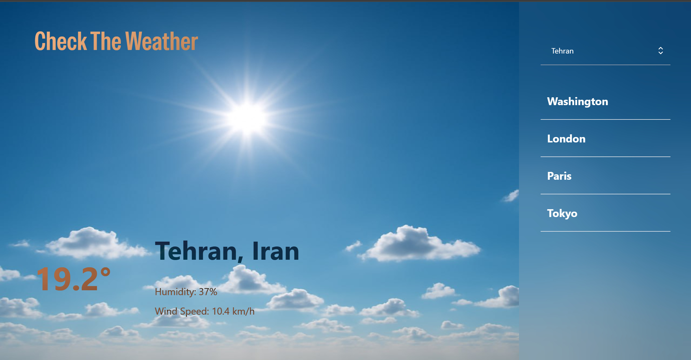

# 🌦️ Weather App

A simple and responsive weather app built with **React** that displays real-time weather information for any city using the **OpenWeatherMap API**.

---

## 🔗 Live Demo

👉 [View Demo](https://misaghemir.github.io/Weather-app)



---

## ✨ Features

- Search weather by city name
- Displays:
  - Temperature
  - Weather condition (e.g. clear, cloudy, rain)
  - Humidity
  - Wind speed
- Responsive UI (works on mobile & desktop)
- Clean and minimalist design

---

## 🚀 Tech Stack

- [React](https://reactjs.org/)
- [Axios](https://axios-http.com/)
- [Tailwind CSS](https://tailwindcss.com/) *(optional, for styling)*
- [OpenWeatherMap API](https://openweathermap.org/api)

---

## ⚙️ Getting Started

### Prerequisites

- Node.js and npm (or yarn)
- An API key from [OpenWeatherMap](https://openweathermap.org/api)

### Installation

1. Clone the repository:

```bash
git clone https://github.com/your-username/weather-app.git
cd weather-app
```

2. Install dependencies:

```bash
npm install
# or
yarn
```

3. Create a `.env` file in the root directory and add your API key:

```env
REACT_APP_WEATHER_API_KEY=your_api_key_here
```

4. Start the development server:

```bash
npm start
# or
yarn start
```

Your app will run at `http://localhost:3000`.

---

## 📁 Folder Structure

```
weather-app/
├── public/
├── src/
│   ├── components/
│   ├── App.tsx
│   ├── index.tsx
    ├── WeatherApp.tsx
│   └── ...
├── .env
├── package.json
└── README.md
```

---

## 🖼️ Screenshot

Here’s what the app looks like:


*Replace this image with your own screenshot*

---

## 📄 License

This project is licensed under the [MIT License](LICENSE).

---

## 🙌 Acknowledgments

- [OpenWeatherMap](https://openweathermap.org/)
- [React Docs](https://reactjs.org/docs/)
- [Tailwind CSS](https://tailwindcss.com/)